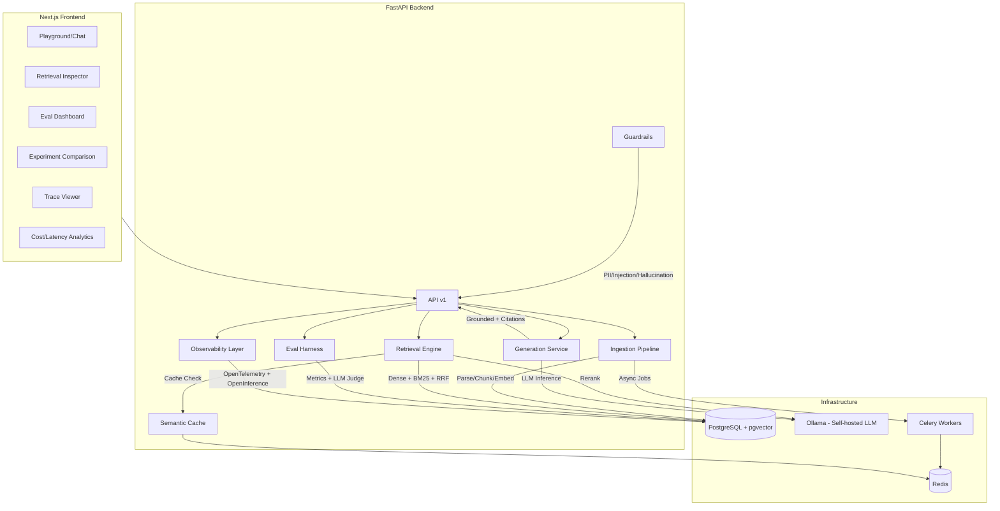

# 🔬 RAGScope

**Self-hosted, production-grade RAG platform with built-in evaluation & observability layer**

> Not another PDF chatbot — RAGScope rebuilds the core mechanics of LangSmith, Arize Phoenix, and Langfuse in one self-hosted platform, with hybrid retrieval, cross-encoder reranking, LLM-as-judge evaluation, OpenTelemetry tracing, and CI regression gates.

---

## Architecture



## Tech Stack

| Layer | Technology | Why |
|-------|-----------|-----|
| **Backend** | FastAPI (Python 3.11) | Async-native, auto OpenAPI docs |
| **Frontend** | Next.js 15 (App Router) | SSR, React Server Components |
| **Database** | PostgreSQL 16 + pgvector | Relational + vector in one DB |
| **LLM** | Ollama (Llama 3.1 / Qwen3) | Fully self-hosted |
| **Embeddings** | Dual: Ollama + Gemini API | Swappable registry, benchmark both |
| **Cache/Queue** | Redis 7 + Celery | Semantic cache + async ingestion |
| **Tracing** | OpenTelemetry + OpenInference | Industry-standard distributed tracing |
| **CI/CD** | GitHub Actions | Lint, test, eval regression gates |
| **Deploy** | Docker Compose (dev) → GCP Cloud Run (prod) | Local-first, cloud-ready |

## Phase 5 — Latency Optimizations

Key changes that reduce end-to-end query latency:

| Optimization | Before | After | Savings |
|---|---|---|---|
| **Batched embedding** | N HTTP calls (1 per text) | 1 call (batch /api/embed) | ~60% |
| **Batched reranking** | N LLM calls (1 per chunk) | 1 LLM call (structured scoring) | ~90% |
| **Concurrent retrieval** | Sequential dense → sparse | `asyncio.gather(dense, sparse)` | ~40% |
| **BM25 index caching** | Full DB scan per query | Cached in-process, invalidated on ingest | ~200ms saved |
| **Semantic cache** | O(n) per-key cosine loop | Batched MGET + numpy vectorized cosine | ~80% |
| **Connection pooling** | New httpx client per call | Shared singleton with keep-alive | ~50ms/request |

## Guardrails

RAGScope includes three production-grade guardrails:

| Guard | Type | Description |
|---|---|---|
| **PII Redactor** | Input/Output | Regex-based detection of emails, phone numbers, SSN, credit cards, IPs. Redacts before storage and display. |
| **Injection Detector** | Input | Heuristic pattern matching for 7 categories of prompt injection (role impersonation, ignore instructions, jailbreak, etc.) with confidence scoring. |
| **Hallucination Detector** | Output | LLM-based groundedness scoring — verifies that every claim in the answer is supported by the retrieved context. |

All guardrails are configurable via environment variables:
```env
ENABLE_PII_REDACTION=true
ENABLE_INJECTION_DETECTION=true
ENABLE_HALLUCINATION_DETECTION=true
INJECTION_THRESHOLD=0.5
HALLUCINATION_THRESHOLD=0.7
```

## Benchmark Results

> Run benchmarks: `python -m app.scripts.benchmark --queries 20 --base-url http://localhost:8000`

| Metric | Dense | Hybrid (RRF) | Hybrid + Rerank |
|--------|-------|-------------|-----------------|
| p50 Latency (ms) | — | — | — |
| p95 Latency (ms) | — | — | — |
| p99 Latency (ms) | — | — | — |

| Cache Metric | Value |
|---|---|
| Cache Miss p50 | — |
| Cache Hit p50 | — |
| Speedup | — |

> _Fill in by running the benchmark script against your deployment._

## Quickstart

```bash
# 1. Clone
git clone https://github.com/sahilsahu4102/ragscope.git
cd ragscope

# 2. Configure
cp .env.example .env

# 3. Start all services
make dev
# or: docker compose up --build -d

# 4. Pull LLM models (first time only)
make pull-models

# 5. Run database migrations
make migrate

# 6. Open
# Frontend: http://localhost:3000
# Backend API: http://localhost:8000/docs
# Health: http://localhost:8000/healthz

# 7. Run benchmarks (after ingesting documents)
docker compose exec backend python -m app.scripts.benchmark
```

## Project Structure

```
ragscope/
├── docker-compose.yml          # 6-service stack
├── Makefile                    # Dev shortcuts
├── .env.example                # Config template
├── .github/workflows/          # CI + eval regression gate
├── documents/                  # Phase-by-phase documentation
├── docs/adr/                   # Architecture Decision Records
├── backend/
│   ├── app/
│   │   ├── main.py             # FastAPI entrypoint
│   │   ├── config.py           # Pydantic Settings
│   │   ├── http_client.py      # Shared httpx connection pool (Phase 5)
│   │   ├── api/v1/             # Versioned endpoints
│   │   ├── ingestion/          # Parse, chunk, embed
│   │   ├── retrieval/          # Dense, BM25, RRF, rerank
│   │   ├── generation/         # LLM, prompts, citations
│   │   ├── eval/               # Metrics, LLM judge, datasets
│   │   ├── observability/      # OTel, OpenInference, cost
│   │   ├── caching/            # Semantic cache
│   │   ├── guardrails/         # PII, injection, hallucination (Phase 5)
│   │   ├── models/             # SQLAlchemy models
│   │   ├── schemas/            # Pydantic schemas
│   │   ├── db/                 # Session, migrations
│   │   ├── scripts/            # Benchmark suite (Phase 5)
│   │   └── workers/            # Celery tasks
│   └── tests/
├── frontend/                   # Next.js dashboard
└── eval-datasets/              # Versioned golden sets (JSONL)
```

## Roadmap

- [x] **Phase 0** — Scaffold & DevOps Foundation
- [x] **Phase 1** — MVP Vertical Slice (ingest → retrieve → generate → chat)
- [x] **Phase 2** — Advanced Retrieval (hybrid/RRF, reranking, caching)
- [x] **Phase 3** — Eval Harness (metrics, LLM judge, CI gates)
- [x] **Phase 4** — Observability & Experiments (traces, A/B, analytics)
- [x] **Phase 5** — Latency Optimization, Guardrails, Benchmarking

## License

MIT
