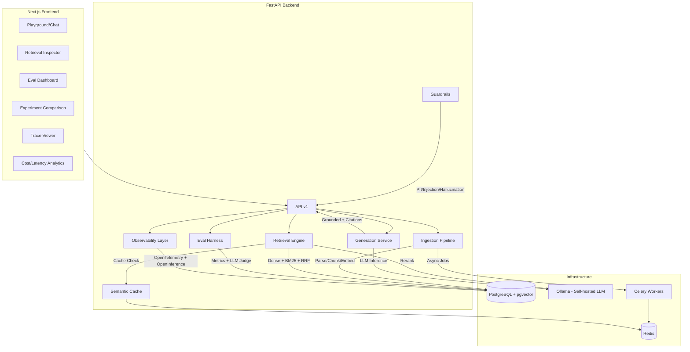

# 🔬 RAGScope

**Self-hosted, production-grade RAG platform with built-in evaluation & observability layer**

> Not another PDF chatbot — RAGScope rebuilds the core mechanics of LangSmith, Arize Phoenix, and Langfuse in one self-hosted platform, with hybrid retrieval, cross-encoder reranking, LLM-as-judge evaluation, OpenTelemetry tracing, and CI regression gates.

---

## Architecture



## Tech Stack

| Layer | Technology | Why |
|-------|-----------|-----|
| **Backend** | FastAPI (Python 3.11) | Async-native, auto OpenAPI docs |
| **Frontend** | Next.js 15 (App Router) | SSR, React Server Components |
| **Database** | PostgreSQL 16 + pgvector | Relational + vector in one DB |
| **LLM** | Ollama (Llama 3.2 3B) | Self-hosted; 3B fits a 4GB GPU fully, 8B did not |
| **Reranker** | ms-marco-MiniLM-L-6-v2 (22M) | Cross-encoder; 123x faster and better than LLM scoring |
| **Embeddings** | Dual: Ollama + Gemini API | Swappable registry, benchmark both |
| **Vector index** | pgvector HNSW (m=16, ef=64) | 82x over exact scan at 100k, recall@10 0.995 |
| **Cache/Queue** | Redis 7 + Celery | Semantic cache + async ingestion |
| **Tracing** | OpenTelemetry + OpenInference | Industry-standard distributed tracing |
| **CI/CD** | GitHub Actions | Lint, format, tests; eval gate gated on a runner with model access |
| **Deploy** | Docker Compose (dev) → GCP Cloud Run (prod) | Local-first, cloud-ready |

## Latency work

Phase 5 optimised within the existing design. Phase 6 instrumented it first,
which changed what looked worth optimising.

**Phase 5** — batched embedding, batched reranking, concurrent dense+sparse,
in-process BM25 cache, shared httpx pool. Real improvements, but the reranker
was still 62s per query: the batching reduced *how many* LLM calls reranking
made without questioning whether it should use an LLM at all.

**Phase 6** — OpenTelemetry span attribution over the whole pipeline, then
fixes ranked by what the spans actually showed:

| Change | Effect |
|---|---|
| LLM reranker → 22M cross-encoder | 62,086 ms → 507 ms |
| llama3.1:8b → llama3.2:3b (8B ran 58% on CPU in 4GB VRAM) | 34,820 ms → 3,300 ms |
| Groundedness guardrail moved off the request path | ~8,900 ms removed |
| Streaming reuses the shared connection pool | one fewer TCP handshake/request |

**Phase 7** — scaling and caching, measured before and after:

| Change | Effect |
|---|---|
| pgvector HNSW + `random_page_cost=1.1` | 373 ms → 4.6 ms at 100k, recall@10 0.995 |
| Semantic cache: local matrix + version counter | 124.5 ms → 0.12 ms at 1k entries |
| BM25 → Postgres FTS | **rejected** — measured 2.2x slower, kept BM25 |

Two things worth noting, because they are the useful part:

- The HNSW index changed nothing until `random_page_cost` was lowered.
  Postgres kept choosing a sequential scan over it; the default of 4.0 models
  spinning-disk seeks and overprices index scans on NVMe. An ANN index can be
  present, correct, and entirely unused.
- Replacing BM25 with Postgres FTS looked obviously right and was wrong.
  Measured at 5k/25k/100k rows, FTS was ~2.2x slower at every size, because
  question-shaped queries need OR semantics and `ts_rank_cd` then has to score
  ~16% of the corpus. The change was kept switchable and the default reverted.

## Guardrails

RAGScope includes three production-grade guardrails:

| Guard | Type | Description |
|---|---|---|
| **PII Redactor** | Input/Output | Regex-based detection of emails, phone numbers, SSN, credit cards, IPs. Redacts before storage and display. |
| **Injection Detector** | Input | Heuristic pattern matching for 7 categories of prompt injection (role impersonation, ignore instructions, jailbreak, etc.) with confidence scoring. |
| **Hallucination Detector** | Output | LLM-based groundedness scoring — verifies that every claim in the answer is supported by the retrieved context. |

All guardrails are configurable via environment variables:
```env
ENABLE_PII_REDACTION=true
ENABLE_INJECTION_DETECTION=true
ENABLE_HALLUCINATION_DETECTION=true
INJECTION_THRESHOLD=0.5
HALLUCINATION_THRESHOLD=0.7
```

## Benchmark Results

> `python -m app.scripts.benchmark --queries 5 --skip-throughput`
> Corpus: 5,869 chunks / 4 documents. Single RTX 3050 Laptop (4GB VRAM).
> Full methodology and caveats: [docs/eval-results.md](docs/eval-results.md)

| Mode | p50 | Mean |
|---|---|---|
| Dense only | 8,522 ms | 8,638 ms |
| Hybrid (RRF) | 8,409 ms | 8,546 ms |
| Hybrid + rerank | 8,007 ms | 8,731 ms |

| Cache Metric | Value |
|---|---|
| Cache miss p50 | 9,035 ms |
| Cache hit p50 | 49 ms |
| Speedup | **185x** |

All three retrieval modes land within noise of each other: after Phase 6,
generation dominates end-to-end latency and retrieval is a rounding error
against it. n=5, so p95/p99 are not reported — at that sample size they are
just the maximum.

### Per-stage attribution (OpenTelemetry spans)

| Stage | Before | After |
|---|---|---|
| Rerank | 62,086 ms | **507 ms** |
| LLM generation | 34,820 ms | 3,300 ms |
| Groundedness guardrail (on critical path) | ~8,900 ms | moved off-path |
| Vector scan | ~15.5 ms | 3.7 ms |
| Semantic cache lookup @1k entries | 124.5 ms | **0.12 ms** |
| **End-to-end (hybrid + rerank)** | **117.0 s** | **~8 s** |

The reranker was the dominant cost — an 8B decoder prompted to emit relevance
scores. Replacing it with a 22M cross-encoder was 123x faster on that stage
*and* improved retrieval quality (NDCG@10 0.18 -> 0.90, p<0.001).

> _Fill in by running the benchmark script against your deployment._

## Quickstart

```bash
# 1. Clone
git clone https://github.com/sahilsahu4102/ragscope.git
cd ragscope

# 2. Configure
cp .env.example .env

# 3. Start all services
make dev
# or: docker compose up --build -d

# 4. Pull LLM models (first time only)
make pull-models

# 5. Run database migrations
make migrate

# 6. Open
# Frontend: http://localhost:3000
# Backend API: http://localhost:8000/docs
# Health: http://localhost:8000/healthz

# 7. Run benchmarks (after ingesting documents)
docker compose exec backend python -m app.scripts.benchmark
```

## Project Structure

```
ragscope/
├── docker-compose.yml          # 6-service stack
├── Makefile                    # Dev shortcuts
├── .env.example                # Config template
├── .github/workflows/          # CI + eval regression gate
├── documents/                  # Phase-by-phase documentation
├── docs/adr/                   # Architecture Decision Records
├── backend/
│   ├── app/
│   │   ├── main.py             # FastAPI entrypoint
│   │   ├── config.py           # Pydantic Settings
│   │   ├── http_client.py      # Shared httpx connection pool (Phase 5)
│   │   ├── api/v1/             # Versioned endpoints
│   │   ├── ingestion/          # Parse, chunk, embed
│   │   ├── retrieval/          # Dense, BM25, RRF, rerank
│   │   ├── generation/         # LLM, prompts, citations
│   │   ├── eval/               # Metrics, LLM judge, datasets
│   │   ├── observability/      # OTel, OpenInference, cost
│   │   ├── caching/            # Semantic cache
│   │   ├── guardrails/         # PII, injection, hallucination (Phase 5)
│   │   ├── models/             # SQLAlchemy models
│   │   ├── schemas/            # Pydantic schemas
│   │   ├── db/                 # Session, migrations
│   │   ├── scripts/            # Benchmark suite (Phase 5)
│   │   └── workers/            # Celery tasks
│   └── tests/
├── frontend/                   # Next.js dashboard
└── eval-datasets/              # Versioned golden sets (JSONL)
```

## Roadmap

- [x] **Phase 0** — Scaffold & DevOps Foundation
- [x] **Phase 1** — MVP Vertical Slice (ingest → retrieve → generate → chat)
- [x] **Phase 2** — Advanced Retrieval (hybrid/RRF, reranking, caching)
- [x] **Phase 3** — Eval Harness (metrics, LLM judge, CI gates)
- [x] **Phase 4** — Observability & Experiments (traces, A/B, analytics)
- [x] **Phase 5** — Latency Optimization, Guardrails, Benchmarking

## License

MIT
